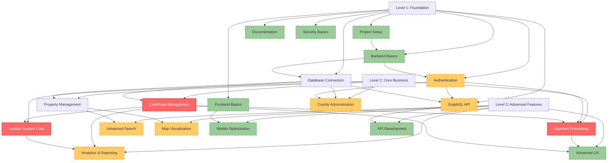

# Task Complexity and Dependency Diagram

```mermaid
graph TD
    %% Level 1 Tasks
    L1[Level 1: Foundation] --> PS[Project Setup]
    L1 --> BB[Backend Basics]
    L1 --> Auth[Authentication]
    L1 --> DB[Database Connection]
    L1 --> GQL[GraphQL API]
    L1 --> FB[Frontend Basics]
    L1 --> Doc[Documentation]
    L1 --> Sec[Security Basics]

    %% Level 1 Dependencies
    PS --> BB
    BB --> Auth
    BB --> DB
    Auth --> GQL
    DB --> GQL

    %% Level 2 Tasks
    L2[Level 2: Core Business] --> ASC[Auction System Core]
    L2 --> PMS[Property Management]
    L2 --> CM[Certificate Management]
    L2 --> PP[Payment Processing]
    L2 --> CA[County Administration]
    
    %% Level 2 Dependencies
    DB --> PMS
    DB --> CM
    Auth --> PP
    CM --> PP
    CM --> ASC
    DB --> CA
    Auth --> CA

    %% Level 3 Tasks
    L3[Level 3: Advanced Features] --> AS[Advanced Search]
    L3 --> MV[Map Visualization]
    L3 --> AR[Analytics & Reporting]
    L3 --> MO[Mobile Optimization]
    L3 --> API[API Development]
    L3 --> UX[Advanced UX]

    %% Level 3 Dependencies
    PMS --> AS
    PMS --> MV
    CM --> AR
    ASC --> AR
    FB --> MO
    GQL --> API
    PP --> UX
    CM --> UX

    %% Complexity Styling
    classDef highComplexity fill:#ff6666,stroke:#cc0000,color:white
    classDef mediumComplexity fill:#ffcc66,stroke:#ff9900
    classDef lowComplexity fill:#99cc99,stroke:#339933

    %% Assign Complexity Classes
    class ASC,CM,PP highComplexity
    class Auth,GQL,CA,MV,AS,AR mediumComplexity
    class PS,BB,FB,Doc,Sec,MO,API,UX lowComplexity
```
