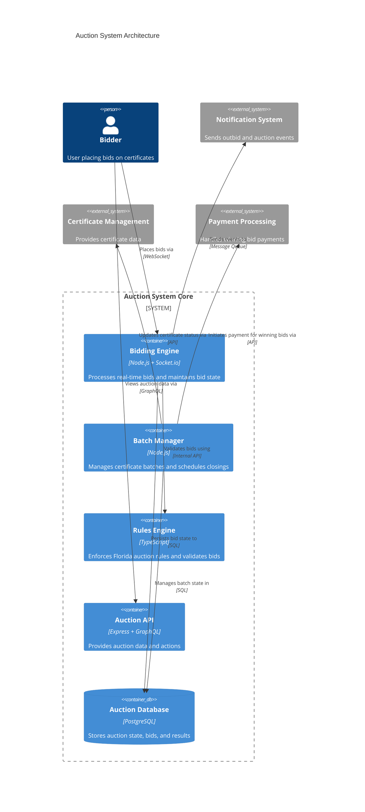
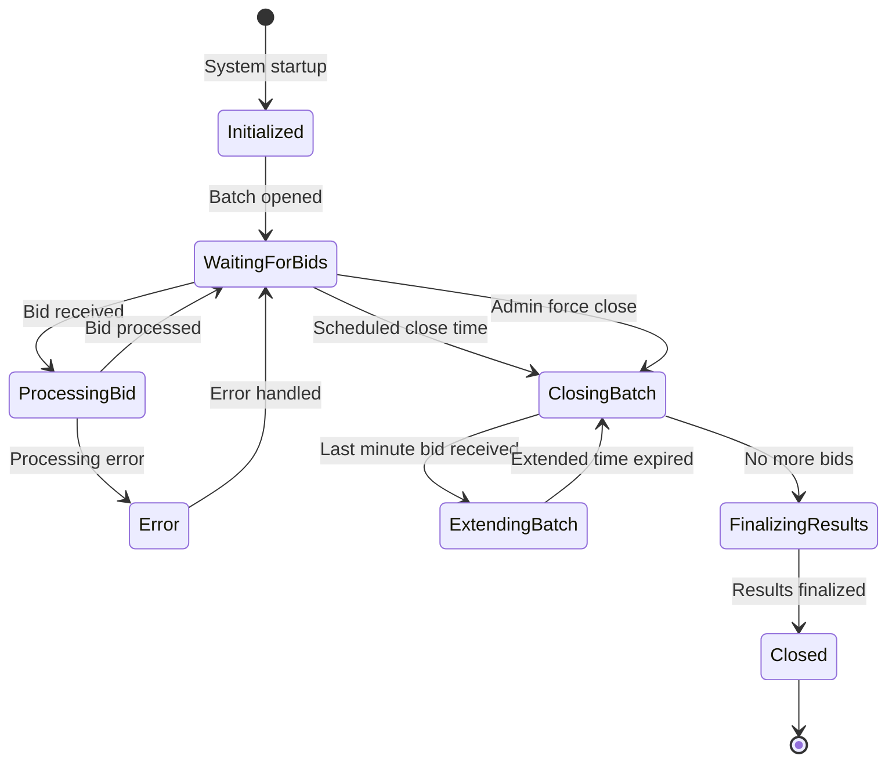

# Auction System Core - Component Template

## Component Overview

The Auction System Core is responsible for managing real-time bidding on tax certificates, handling concurrent users, and ensuring data integrity during auction events. It processes bids, manages certificate batches, and enforces Florida-specific auction rules.

## Architecture



## Key Classes/Modules

### BiddingEngine
```typescript
class BiddingEngine {
  // Manages active WebSocket connections
  private connections: Map<string, BidderConnection>;
  // In-memory state of current bids for active certificates
  private bidState: Map<string, CertificateBidState>;
  
  // Initialize the bidding engine
  constructor(configOptions: BiddingEngineOptions) { ... }
  
  // Handle new bidder connection
  public handleConnection(socket: Socket): void { ... }
  
  // Process incoming bid
  public async processBid(bid: Bid): Promise<BidResult> { ... }
  
  // Handle certificate batch closing
  public async closeBatch(batchId: string): Promise<BatchResult> { ... }
  
  // Recover state from database (used during startup/failover)
  public async recoverState(): Promise<void> { ... }
}
```

### BatchManager
```typescript
class BatchManager {
  // Active batch schedules
  private batchSchedules: Map<string, BatchSchedule>;
  
  // Initialize with configuration
  constructor(config: BatchManagerConfig) { ... }
  
  // Schedule a new batch for auction
  public async scheduleBatch(batch: CertificateBatch): Promise<void> { ... }
  
  // Process batch closing
  private async closeBatch(batchId: string): Promise<void> { ... }
  
  // Update batch schedule
  public async updateSchedule(batchId: string, schedule: BatchSchedule): Promise<void> { ... }
  
  // Handle failed batch closing
  private async handleFailedClosing(batchId: string, error: Error): Promise<void> { ... }
}
```

### RulesEngine
```typescript
class RulesEngine {
  // Rule configurations by county
  private countyRules: Map<string, CountyRuleSet>;
  
  // Initialize with Florida rule defaults
  constructor(customRules?: RuleOverrides) { ... }
  
  // Validate a bid against rules
  public validateBid(bid: Bid, certificate: Certificate): ValidationResult { ... }
  
  // Check if certificate can be included in batch
  public validateBatchInclusion(certificate: Certificate, batch: Batch): ValidationResult { ... }
  
  // Determine if batch is ready to close
  public canCloseBatch(batch: Batch): ValidationResult { ... }
  
  // Get certificate specific rules
  public getCertificateRules(certificate: Certificate): CertificateRules { ... }
}
```

## Interface Definitions

### Bid Interface
```typescript
interface Bid {
  id: string;
  bidderId: string;
  certificateId: string;
  interestRate: number;  // Between 0-18%, validated by rules engine
  timestamp: Date;
  ipAddress: string;
  deviceId: string;
  isAutomated: boolean;  // For bulk bid uploads
}
```

### Certificate Interface
```typescript
interface Certificate {
  id: string;
  parcelId: string;
  countyId: string;
  faceValue: number;
  propertyAddress: Address;
  ownerName: string;
  status: CertificateStatus;
  currentInterestRate: number | null;
  winningBidId: string | null;
  batchId: string | null;
}
```

### Batch Interface
```typescript
interface CertificateBatch {
  id: string;
  countyId: string;
  name: string;
  certificates: string[];  // Array of certificate IDs
  openTime: Date;
  scheduledCloseTime: Date;
  actualCloseTime: Date | null;
  status: BatchStatus;
  extendTimeMinutes: number;  // Time to extend if last-minute bid
  minBidInterestRate: number;  // Typically 5% per Florida rules
  allowZeroBids: boolean;     // Florida-specific zero bid exception
}
```

### Connection Events
```typescript
enum BidderConnectionEvent {
  CONNECT = "connect",
  DISCONNECT = "disconnect",
  SUBSCRIBE_BATCH = "subscribe_batch",
  UNSUBSCRIBE_BATCH = "unsubscribe_batch",
  PLACE_BID = "place_bid",
  BID_RESULT = "bid_result",
  OUTBID = "outbid",
  BATCH_UPDATE = "batch_update",
  BATCH_CLOSING = "batch_closing",
  BATCH_CLOSED = "batch_closed",
  ERROR = "error"
}
```

## State Management

### Bidding State Machine


### Persistence Strategy

- **Primary State**: In-memory for active bidding sessions (Redis cluster)
- **Durability**: PostgreSQL for persistent state
- **Write Pattern**:
  - Optimistic locking for bid processing
  - Event sourcing for complete bid history
  - Periodic snapshots of bidding state
- **Recovery**:
  - State reconstruction from event log
  - Heartbeat monitoring for node failure detection
  - Transparent failover to replica nodes

## Error Handling Strategy

### Error Categories

- **Connection Errors**: Handle WebSocket disconnections gracefully
  - Auto-reconnect with exponential backoff
  - Session state recovery on reconnection
  - Transparent request resubmission

- **Concurrency Errors**: Handle race conditions in bidding
  - Optimistic concurrency control with version checking
  - Clear error messages for outdated bids
  - Automated retry for non-conflicting operations

- **Validation Errors**: Handle invalid bids or rule violations
  - Immediate client notification with specific reason
  - Logging of validation failures with context
  - Monitoring for potential fraud patterns

- **System Failures**: Handle infrastructure issues
  - Circuit breaker pattern for dependent services
  - Degraded operation modes when non-critical services fail
  - Automated recovery procedures

### Error Reporting

- Real-time error dashboard for auction administrators
- Structured error logs with context details
- Error aggregation for pattern detection
- Critical error alerting via multiple channels

## Testing Approach

### Unit Testing

- BidValidator for rule compliance (combinations of county rules)
- BatchManager for correct scheduling/closing behavior
- WebSocket connection handling and reconnection logic

### Integration Testing

- API integration with Certificate Management system
- Database persistence and recovery testing
- End-to-end bid processing flow

### Performance Testing

- Load testing with simulated 5,000+ concurrent users
- Latency measurements under various load conditions
- Batch closing performance with high bid volumes
- Recovery time testing for failure scenarios

### Specialized Tests

- Chaos testing with service disruptions
- Consistency verification during node failures
- Race condition testing with concurrent bids
- Long-running auction stability tests

## Performance Considerations

### Scalability

- Horizontal scaling of WebSocket nodes with sticky sessions
- Read replicas for auction data queries
- Redis cluster for distributed in-memory state
- Partitioning by county and batch for independent scaling

### Optimization Points

- Connection pooling for database access
- Batch processing for multiple bids when possible
- Client-side bid validation to reduce server load
- Efficient WebSocket frame design to minimize payload size

### Monitoring

- Real-time dashboard of active connections
- Bid processing latency tracking
- Connection error rate monitoring
- Node resource utilization alerts
- Concurrent user count by county/batch

## Implementation Considerations

### Florida-Specific Requirements

- Support for reverse-auction format (bidding down from 18%)
- Enforcement of 5% minimum interest rate with zero bid exceptions
- County-specific customization of auction rules
- Certificate batch grouping with configurable schedules

### Security Measures

- Authentication for all bidder connections
- Rate limiting to prevent bid flooding
- IP and device tracking for fraud prevention
- Bid verification against available deposit balance
- Audit logging of all bid activities

### Resilience Features

- Graceful degradation during partial failures
- Read-only mode for auction viewing when bidding is unavailable
- Automated recovery procedures for common failure scenarios
- Geographical redundancy for disaster recovery
