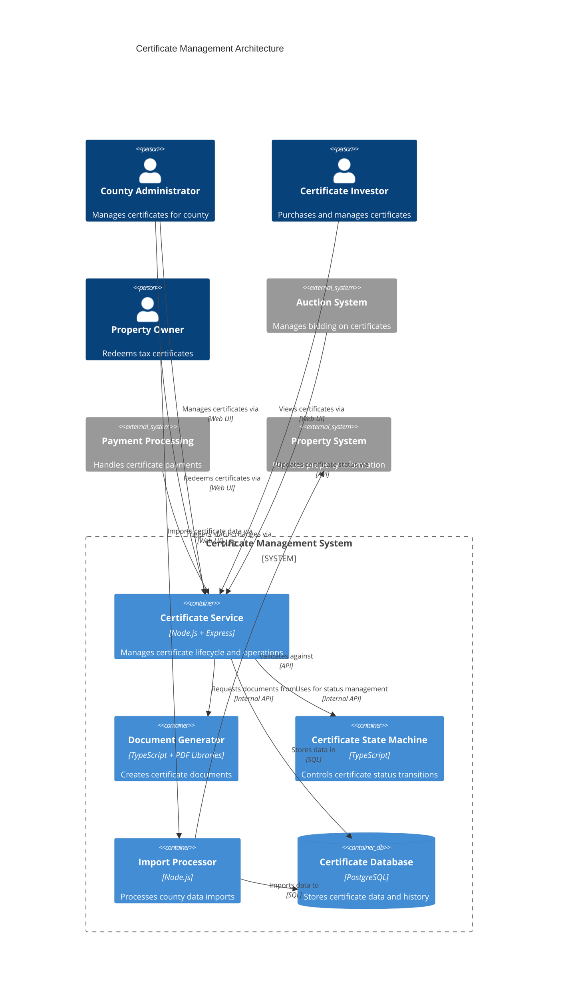

# Certificate Management - Component Template

## Component Overview

The Certificate Management system is responsible for the entire lifecycle of tax certificates from creation through redemption. It manages certificate data, status transitions, document generation, and provides certificate information to other system components. This system ensures compliance with Florida regulations for tax certificates.

## Architecture

