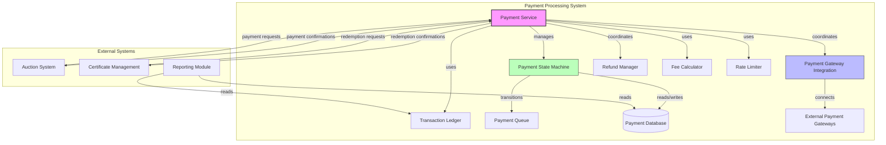
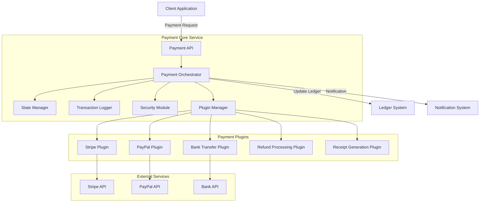

# Payment Processing - Component Template

## Component Overview

The Payment Processing system manages all financial transactions within the tax certificate platform. It handles bidder deposits, auction payments, certificate redemptions, and ensures accurate financial records are maintained. The system integrates with payment gateways while maintaining high security standards for financial data.

## Architecture Diagram




## Component Options

### Option 1: Monolithic Payment Service

**Description**:
Implement payment processing as a single, comprehensive service that handles all payment-related functionality internally.

**Pros**:
- Simpler implementation with all payment logic in one place
- Easier state management and transaction coordination
- No service communication overhead
- Simpler deployment model

**Cons**:
- Harder to scale specific payment functions independently
- Increased deployment risk as all payment functions deploy together
- Less flexibility for technology choices within payment subsystems
- May become a large, complex codebase over time

### Option 2: Microservices Payment Architecture

**Description**:
Decompose payment processing into specialized microservices (e.g., payment gateway service, ledger service, refund service).

**Pros**:
- Improved scalability for specific payment functions
- Independent deployment of payment components
- Better fault isolation
- Teams can work on payment components independently
- Flexibility to use different technologies per service

**Cons**:
- More complex service orchestration
- Additional network overhead between services
- Distributed transaction management challenges
- More complex testing and deployment pipeline
- Operational complexity increases

### Option 3: Hybrid Approach with Core Service and Plugins

**Description**:
Implement a core payment service with plugin architecture for gateway integrations and specialized payment functions.

**Pros**:
- Maintains central payment orchestration while allowing specialized components
- Gateway integrations can be developed and deployed independently
- Core payment logic remains centralized for consistency
- Easier to add new payment methods or gateways
- Better balance of scalability and simplicity

**Cons**:
- Plugin architecture requires careful design
- Still needs coordination for state management across plugins
- May have higher initial development overhead
- Requires clear interface definitions between core and plugins

## Recommended Approach

The **Hybrid Approach with Core Service and Plugins** (Option 3) offers the best balance for the Tax Certificate Sale platform. This approach:

1. Maintains centralized payment orchestration and state management through a core service
2. Enables flexible integration with multiple payment gateways through a plugin architecture
3. Supports independent deployment of gateway integrations
4. Provides clear separation of concerns while minimizing distributed transaction complexity
5. Allows for easier addition of new payment methods or gateways in the future
6. Balances development simplicity with operational scalability

The plugin architecture is particularly valuable as it will allow the platform to adapt to changing payment processor requirements and add new payment methods without significant rework of the core payment logic.

## Implementation Guidelines

### Architecture



### Core Components

1. **Payment Orchestrator**
   - Central component responsible for coordinating payment flows
   - Implements payment business logic and validation
   - Manages payment state transitions
   - Coordinates with other system components

2. **Plugin Manager**
   - Manages registration and lifecycle of payment plugins
   - Routes payment requests to appropriate plugins
   - Provides plugin discovery and configuration mechanisms
   - Handles plugin versioning and compatibility

3. **State Manager**
   - Tracks payment state throughout lifecycle
   - Implements state persistence with transaction support
   - Provides recovery mechanisms for failed transactions
   - Maintains audit trail of state changes

4. **Security Module**
   - Handles sensitive payment data encryption/decryption
   - Implements PCI compliance requirements
   - Manages tokenization of payment methods
   - Enforces access control for payment operations

### Plugin Interface Design

```typescript
interface PaymentPlugin {
  // Plugin metadata
  readonly id: string;
  readonly version: string;
  readonly supportedPaymentMethods: PaymentMethod[];
  
  // Core operations
  initialize(config: PluginConfig): Promise<boolean>;
  processPayment(request: PaymentRequest): Promise<PaymentResult>;
  validatePaymentMethod(method: PaymentMethod): Promise<ValidationResult>;
  
  // Optional operations (may throw UnsupportedOperationError)
  refundPayment?(transactionId: string, amount: Money): Promise<RefundResult>;
  getTransactionStatus?(transactionId: string): Promise<TransactionStatus>;
  voidTransaction?(transactionId: string): Promise<VoidResult>;
}
```

### Error Handling Strategy

1. **Standardized Error Types**
   - PaymentValidationError: For validation issues with payment data
   - GatewayConnectionError: For communication issues with payment providers
   - PaymentDeclinedError: For declined transactions with specific reason codes
   - InsufficientFundsError: Specific error for insufficient funds
   - SystemError: For internal system failures

2. **Retry Policies**
   - Implement exponential backoff for transient failures
   - Define clear retry boundaries for different error types
   - Provide hooks for manual intervention on critical failures

3. **Recovery Mechanisms**
   - Implement compensating transactions for partial failures
   - Maintain transaction journal for manual recovery
   - Provide administrative tools for payment reconciliation

### Testing Approach

1. **Unit Testing**
   - Test each component in isolation with mocked dependencies
   - Focus on business logic validation in the orchestrator
   - Test plugin interface compliance for each plugin

2. **Integration Testing**
   - Test interaction between core service and plugins
   - Verify state transitions across components
   - Test error handling and recovery paths

3. **Gateway Simulators**
   - Develop simulators for each payment gateway
   - Simulate various success/failure conditions
   - Test timeout and partial failure scenarios

4. **End-to-End Testing**
   - Test complete payment flows with simulated gateways
   - Verify system integration with ledger and notification systems
   - Test reconciliation processes

### Performance Considerations

1. **Scalability**
   - Design core service for horizontal scalability
   - Implement stateless processing where possible
   - Use message queues for asynchronous processing

2. **Monitoring**
   - Track payment success/failure rates by gateway
   - Monitor processing times for each payment step
   - Alert on unusual error patterns or performance degradation

3. **Optimizations**
   - Implement connection pooling for gateway connections
   - Cache frequently used data (e.g., payment method validation)
   - Batch operations where appropriate (e.g., settlement processing)

### Deployment Strategy

1. **Core Service Deployment**
   - Deploy as containerized service with scaled replicas
   - Implement blue/green deployment for zero downtime updates
   - Maintain multiple environments (dev, staging, production)

2. **Plugin Deployment**
   - Deploy plugins as separate versioned packages
   - Support runtime loading of plugins
   - Implement canary releases for new gateway integrations
   - Isolate plugin failures from core service
   - Maintain compatibility layer for version differences
